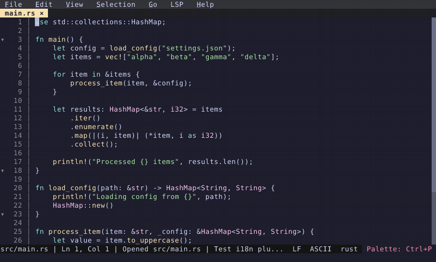

# Code Folding

Fold and unfold code blocks via gutter click or command palette.

  

<!-- Generated by: cargo test --package fresh-editor --test e2e_tests blog_showcase_fresh-0.2.3-0.2.9/code-folding -- --ignored -->
<!-- Then run: scripts/frames-to-gif.sh docs/blog/fresh-0.2.3-0.2.9/code-folding -->
