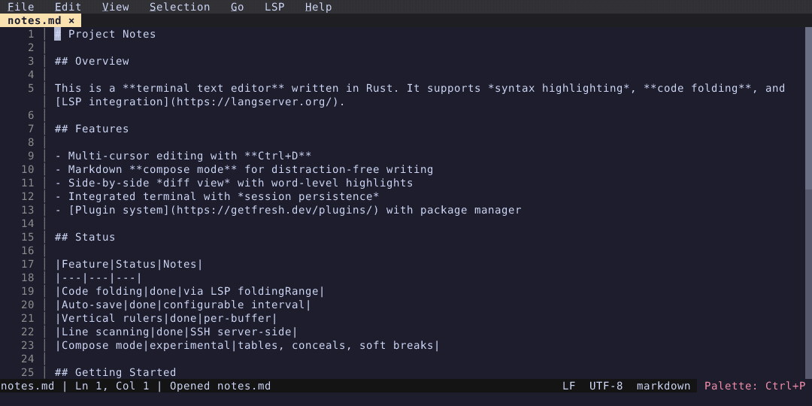
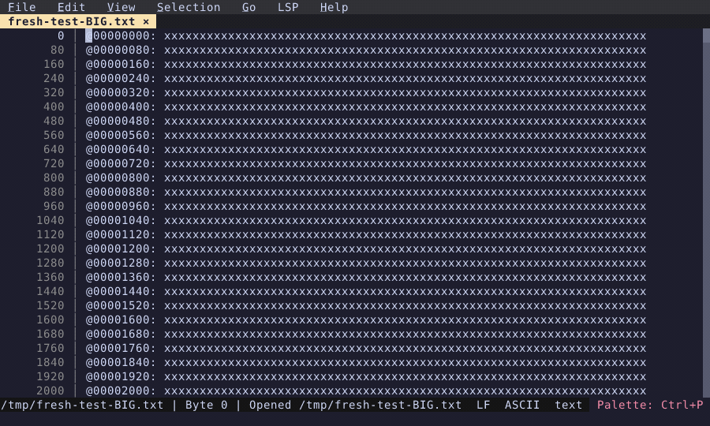
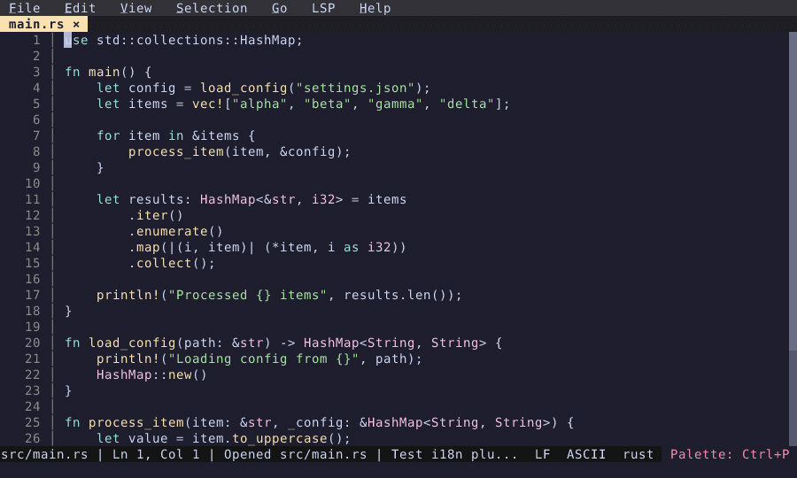
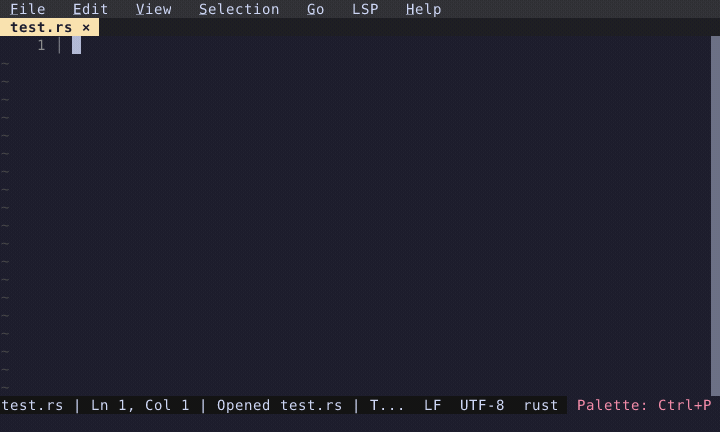
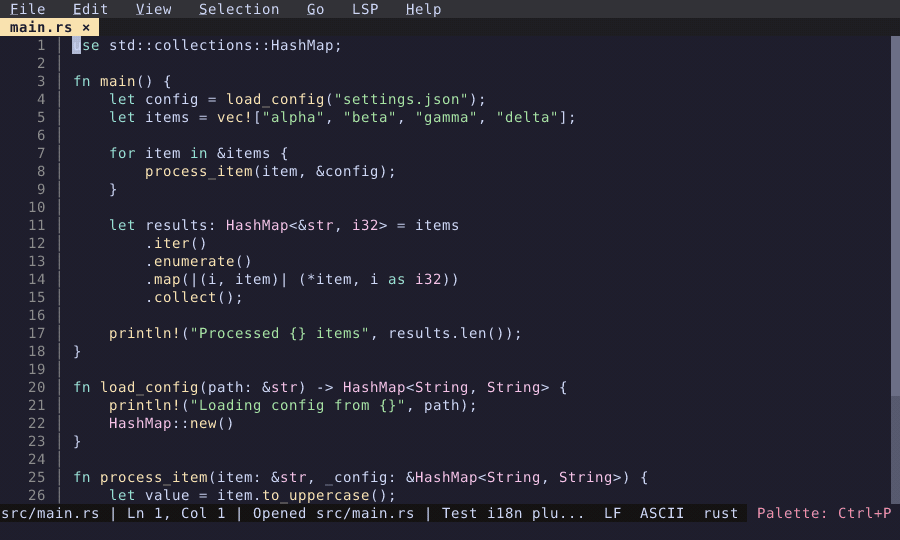

# What's New in Fresh (0.2.9)

*February 25, 2026*

A roundup of features and fixes since the [0.2 release](../fresh-0.2/) — over 90 bug fixes, 8 GitHub issues resolved, and a handful of new capabilities.

## Code Folding

Fold and unfold code blocks using LSP `foldingRange`. Click the gutter indicator to collapse a range; click again to expand. Keyboard navigation (Up/Down) skips over folded regions. Each split view maintains its own fold state.

  

## Markdown Editing

Smart editing when writing Markdown: Enter continues list items (bullets, ordered lists, checkboxes), Enter on an empty marker removes it, and Tab indents list items while cycling the bullet style. Single-quote auto-close is disabled in Markdown files so apostrophes don't interfere. (This is implemented as a built-in plugin, `markdown_source`, enabled by default.)

### Compose Mode (experimental)

On top of source editing, an experimental compose mode conceals syntax markers (`**`, `*`, ``), applies soft line breaks at a configurable width, and renders tables. Open the same file in a vertical split to see source and composed views side by side.

  

## Precise Go to Line in Large Files

Fresh adds support for precise **line numbers in very large files**. The new default when opening a large file shows exact **byte offsets** in the gutter, instead of  approximate line numbers. Using "Go to Line" (`Ctrl+G`) offers to scan the file — only the line index is kept in memory, not the file contents. Over SSH, the scan runs server-side and only the index is transferred. Open remote files with `fresh user@host:/path/to/file` — see [Remote Editing (SSH)](/features/ssh) for details.

  

## Vertical Rulers

Add column rulers at any position via the "Add Ruler" command. Useful for enforcing line length limits. Rulers are per-buffer and can be added or removed from the command palette.

  

## Smart Editing

Smart Home toggles between first non-whitespace character and column 0. Smart Backspace in leading whitespace removes one indent level instead of a single character. Auto-indent fixes: Go files dedent with tabs, `tab_size` is respected, Python nested indentation after consecutive `:` lines works correctly.

  

## Auto-Save

New `auto_save_enabled` config option. When turned on, modified buffers are saved to disk at a configurable interval (default 30 seconds). The existing crash-recovery auto-save (every 2 seconds to a recovery directory) continues to work independently.

  

## Also New

### Performance

- Replaced linear span lookups in syntax highlighting with an O(1) amortized cursor.
- Path-copying PieceTree mutations with structural diff via `Arc::ptr_eq` — diff cost is proportional to edit regions, not total leaves.
- Eliminated JSON round-trip and JS re-parsing in plugin hook dispatch.
- Viewport-aware gutter indicator batching for large files (~780K IPC commands reduced to ~50 per edit).

### LSP & Diagnostics

- Diagnostics panel: Up/Down scrolls the editor to preview each diagnostic's location; Enter jumps and focuses.
- Fresh now advertises all supported LSP client capabilities, enabling diagnostics from strict servers like pyright.
- Fixed state corruption when toggling LSP off/on — `didClose` is now sent so re-enable gets a fresh `didOpen`.
- LSP status bar indicator no longer disappears after each request.

### Plugin API v2

- Versioned plugin API with `editor.apiVersion()`.
- New `createTerminal`, `sendTerminalInput`, `closeTerminal` for terminal control from plugins.
- Split labels to prevent files opening in managed splits; labels persist across sessions.
- Plugin state API for reading editor state from hooks.

### Quality of Life

- **Horizontal scrollbar** with drag support and toggle commands.
- **Split-view scroll sync** — same-buffer splits can scroll together (toggle via command palette).
- **Glob patterns in language config** — `filenames` field supports `*.conf`, `*rc`, `/etc/**/rc.*` for extensionless file detection.
- **Configurable clipboard** — `use_osc52` and `use_system_clipboard` toggles to prevent hangs in certain terminals.
- **File explorer** — `show_hidden` / `show_gitignored` toggles now persist to config and are applied on startup.
- **Smooth scrolling** — cursor movement scrolls one line at a time instead of recentering the viewport.
- **Macro shortcut** — F4 plays last recorded macro.

## Related

- [Full changelog](https://github.com/sinelaw/fresh/blob/master/CHANGELOG.md)
- [All features](/features/)
- [Getting started](/getting-started/)
